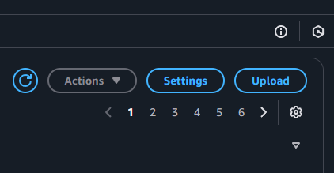
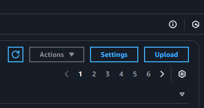

# AWS Squared Corners

**AWS Squared Corners** is a lightweight Chrome extension that restores squared corners for buttons in the AWS Management Console by injecting custom CSS. This extension ensures a clean, modern, squared-off design for all buttons, overriding the default styles.

## Features

- **Simple Design Change**: Removes rounded corners from buttons in AWS, giving them a squared look.
- **Lightweight**: Minimal code with no impact on performance.
- **Seamless Integration**: Automatically applies to all pages under the AWS Management Console (`https://*.console.aws.amazon.com/*`).

## Installation

1. Clone or download the repository to your local machine:

   ```bash
   git clone https://github.com/yourusername/aws-squared-corners.git
   cd aws-squared-corners
   ```

2. Open Google Chrome and navigate to chrome://extensions/.

3. Enable Developer mode by toggling the switch in the top right corner.

4. Click on Load unpacked and select the directory where the extension files are located.

5. Open the AWS Management Console (https://console.aws.amazon.com/) and see the squared corners applied to all buttons.

## Files Overview
`manifest.json` Defines the extension's metadata and configuration, including permissions and content scripts. Key settings:

- Targets AWS domains (https://*.console.aws.amazon.com/*).
- Injects style.css into matching pages.

`style.css` Contains the CSS rule to reset the button border radius:

```css
button {
    border-radius: 0 !important;
}
```


## How It Works

This extension injects a custom CSS file into all AWS Management Console pages. The CSS rule targets all `<button>` elements and sets their `border-radius` to `0`, ensuring squared corners.

## Permissions

The extension requires the following permissions:
- **`activeTab`**: To access the active AWS Management Console page.
- **`host_permissions`**: Restricted to AWS (`https://*.console.aws.amazon.com/*`).

## Screenshots

| Default Buttons                    | Squared Buttons                   |
|------------------------------------|-----------------------------------|
|  |  |

## Limitations

- This extension only applies to pages under the AWS Management Console (`https://*.console.aws.amazon.com/*`).
- Only buttons styled as `<button>` elements are affected.

## Future Improvements

- Add a toggle option in the extension popup to enable or disable the squared corners dynamically.
- Extend functionality to allow users to customize the CSS (e.g., different border-radius values).

## License

This project is licensed under the **BSD 3-Clause License**. See the `LICENSE` file for details.
